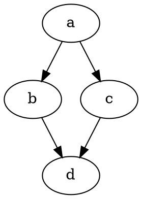

<p align="center"> 

</p>

# 306 Project 1		|		Team 11		|		Para11el    |   [](https://travis-ci.com/SheepySean/306Project1Team11)


## Para11el Task Scheduler 
Welcome to the official page for the Para11el Task Scheduler Project!

**Using AI and parallel processing power to solve difficult scheduling problem**

A branch-and-bound type algorithm that finds an optimal solution for small input task graphs (on a specified number of processors), while preserving the dependencies between the tasks. To achieve additional performance, the implemented branch-and-bound algorithm can be parallelised so that it uses multiple processors to speed up the search. 

## Getting Started

*These instructions will get you a running version of the project on your local machine.*

### Prerequisites

The project should be able to run on all operating systems namely **Linux**.

The project requires:
```
GraphStream (version 2.0)
Java 1.8 (including JavaFX 8)
```

### Additional Requirements

A multicore machine is recommended to access the parallel functionality of the scheduler

## Running the Code (For a Developer)

Please see the Wiki Resources by following the following links:
* [Building with Eclipse](https://github.com/SheepySean/306Project1Team11/wiki/Building-with-Eclipse)
* [Building with IntelliJ IDEA](https://github.com/SheepySean/306Project1Team11/wiki/Building-with-IntelliJ-IDEA)

## Running the Code (For a User)

With Java (plus dependent packages) installed you can run the project code. 

### With the .jar file

Para11el Task Schedule takes a graph in dot format (.dot) as input, and outputs a graph in dot format (.dot) with an optimal schedule.
```java
java -jar scheduler.jar INPUT.dot P [ADDITIONAL OPTIONS]
```
The first two arguments are required:
* `INPUT.dot` is a task graph with integer weights in dot format
* `P` is the number of processors to schedule the input graph on.
The output file will be created in the same directory and the nodes will have additional attributes (the start time of the node and the processor it is scheduled on) with integer weights.

Optional arguments are:
* `-p N` use N cores for execution in parallel 
* `-v` visualise the search (opens a GUI which will allow you to view the input graph, the optimal schedule and the current state of the search)
* `o FILENAME` specify the filename of the output file to be FILENAME 
* `-t SECONDS` time out the search in SECONDS, if a solution has not been found, no output file will be written
* `-d` search for the optimal solution using DFS Algorithm

By default, Para11el Task Scheduler will run sequentially, using an A* Algorithm with no visualisation and the output file will be named INPUT-output.dot (where INPUT is the name of the input graph). 

More information on the command line inputs can be found [here.](https://github.com/SheepySean/306Project1Team11/wiki/Command-Line)

**An example input graph may look like as follows:**


### Building the project yourself

If you wish, you may build the projects .jar file yourself. To do this you need **Maven** installed on your machine.

Simply clone the project on to you machine by running the following command:
```cmd
git clone https://github.com/SheepySean/306Project1Team11.git
```
Locate the **pom.xml** file and run the following command with maven
```maven
clean compile assembly:single
```
This will create a fresh .jar file for executing the project and you may run it by following the steps [above](#with-the-jar-file).


## Folder Structure

The projects folder structure is as follows:

```
306Project1Team11
|
|__example_graphs (Sample graphs for utilising the application)
|  |__example.dot
|  |__Nodes_10_Random.dot
|  |__Nodes_11_OutTree.dot
|  |__Nodes_7_OutTree.dot
|  |__Nodes_8_Random.dot
|  |__Nodes_9_SeriesParallel.dot
|  
|__lib (Libraries folder for any additional project libraries)
|  |__ext (External Libraries)
|     |__graph_stream (GraphStream Library for graph management)
|     |  |__gs-algo-2.0-alpha.jar
|     |  |__gs-core-2.0-alpha.jar
|     |  |__gs-ui-javafx-2.0-alpha.jar
|     |__gs-algo-1.3.jar
|     |__gs-core-1.3.jar
|     |__gs-ui-1.3.jar
|
|__src (.java files for compiling and running the project)
|  |__main (Runner Files)
|  |  |__java
|  |  |  |__com
|  |  |     |__para11el
|  |  |        |__scheduler (Main project package)
|  |  |           |__algorithm
|  |  |           |  |__AStarAlgorithm.java
|  |  |           |  |__AStarStateTask.java
|  |  |           |  |__Algorithm.java
|  |  |           |  |__CostFunctionManager.java 
|  |  |           |  |__DFSForkJoin.java
|  |  |           |  |__DFSInitialiser.java
|  |  |           |  |__NodeManager.java
|  |  |           |  |__OptimalSchedule.java
|  |  |           |  |__Parallellised.java
|  |  |           |  |__PruningManager.java
|  |  |           |  |__State.java
|  |  |           |  |__Task.java  
|  |  |           |  |__Traversable.java
|  |  |           |__graph
|  |  |           |  |__CustomFileSinkDOT.java
|  |  |           |  |__GraphConstants.java
|  |  |           |  |__GraphFileManager.java
|  |  |           |  |__GraphViewManager.java
|  |  |           |__main
|  |  |           |  |__ParameterLengthException.java
|  |  |           |  |__ParameterType.java
|  |  |           |  |__Scheduler.java
|  |  |           |  |__TimeOut.java
|  |  |           |__ui
|  |  |              |__ExitPaneController.java
|  |  |              |__ExitWindow.java
|  |  |              |__ViewerPaneController.java
|  |  |
|  |  |__resources (Other External Resources)
|  |     |__css
|  |     |  |__graph.css
|  |     |  |__main.css
|  |     |__fxml
|  |     |  |__ExitPane.fxml
|  |     |  |__ViewerPane.fxml
|  |     |__images
|  |        |__logo-icon.png
|  |
|  |__test (Test files)
|     |__java
|        |__com
|           |__para11el
|              |__scheduler 
|                 |__algorithm
|                 |  |__test
|                 |     |__AStarAlgorithmHelperIT.java
|                 |     |__AStarParallelIT.java
|                 |     |__AStarSequentialIT.java
|                 |     |__AStarStateTaskIT.java
|                 |     |__CostFunctionManagerIT.java
|                 |     |__DFSParallelIT.java
|                 |     |__DFSSequentialIT.java
|                 |     |__MockNode.java
|                 |     |__ModelClassIT.java
|                 |     |__NodeManagerIT.java
|                 |     |__PruningManagerIT.java
|                 |     |__SolutionValidity.java
|                 |     |__SolutionValidityIT.java
|                 |     |__TestGraphManager.java
|                 |__main
|                     |__test
|                       |__GraphResourceIT.java
|
|__.gitignore
|
|__.travis.yml
|
|__Project1Plan_Team11.pdf (First Milestone Deliverable)
|
|__README.md (You Are Here)
|
|__img.png (Team logo)
|
|__pom.xml (Maven file for building the project)

```

## Helpful Links

*  [GraphStream](http://graphstream-project.org/) - GraphStream project for graph management and visualisation. Simple tutorials can be found [here](http://graphstream-project.org/doc/Tutorials/)

## authors

* **Sean Oldfield** (sold940 - ID: 495219908) - *Development* - [SheepySean](https://github.com/SheepySean)
* **Tina Chen** (tche278 - ID: 831524296) - *Development* - [twchen97](https://github.com/twchen97)
* **Rebekah Berriman** (rber798 - ID: 766858096) - *Development* - [rmberriman](https://github.com/rmberriman)
* **Jessica Alcantara** (jalc504 - ID: 684627681) - *Development* - [Jess-Alcantara](https://github.com/Jess-Alcantara)
* **Holly Hagenson** (hhag130 - ID: 731300076) - *Development* - [hhagenson28](https://github.com/hhagenson28)

## Acknowledgments

* Dr Oliver Sinnen's Research Papers 
* StackOverflow

---
